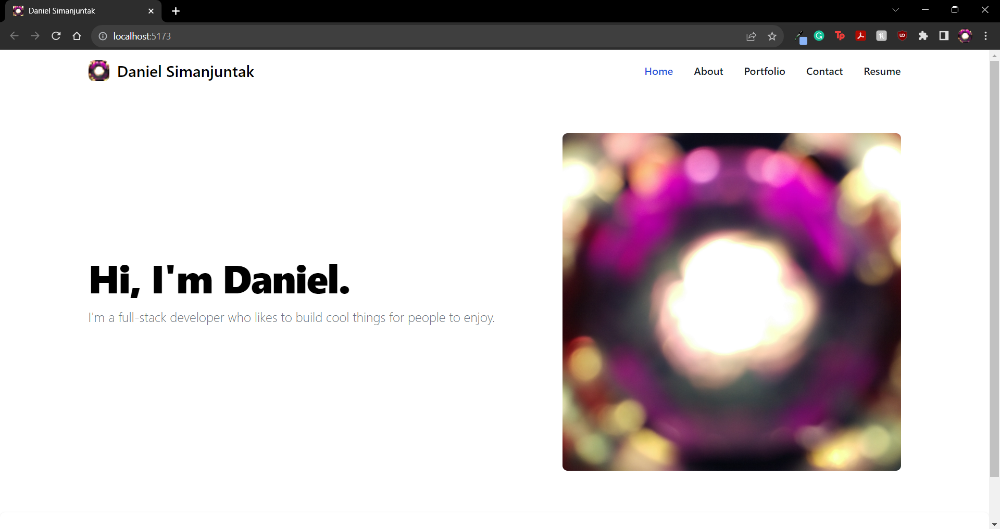

# React-Portfolio

## Description

This is my portfolio, made using React. Check it out!

## Table of Contents

- [Installation](#installation)
- [Usage](#usage)
- [Credits](#credits)
- [License](#license)
- [Contributions](#contributions)
- [Tests](#Tests)
- [Questions](#Questions)

## Installation

N/A

## Usage

N/A

## Credits

- Tailwind: CSS framework
  - https://tailwindcss.com/
- Flowbite: Tailwind components
  - https://flowbite.com/
- UCI BCS for template code
  - ErrorPage.jsx
  - App.jsx
  - main.jsx
- Xpert Learning Assistant for help with:
  - page location checker (Header.jsx lines 8-10)
  - form submission logic (ContactPage.jsx lines 4-17)

## License

This project uses the MIT License.

https://opensource.org/licenses/MIT 

## Contributions

N/A

## Tests

N/A

## Questions

If you have any questions about the project, please reach out!

Github: https://github.com/danhalsim

Email: dansim6935@gmail.com